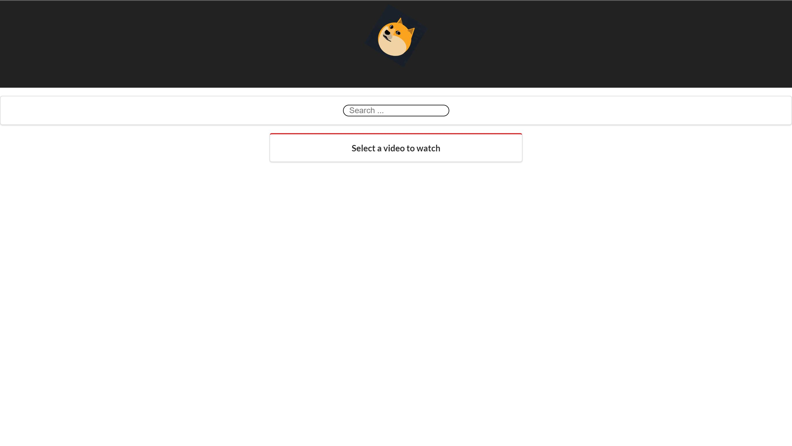
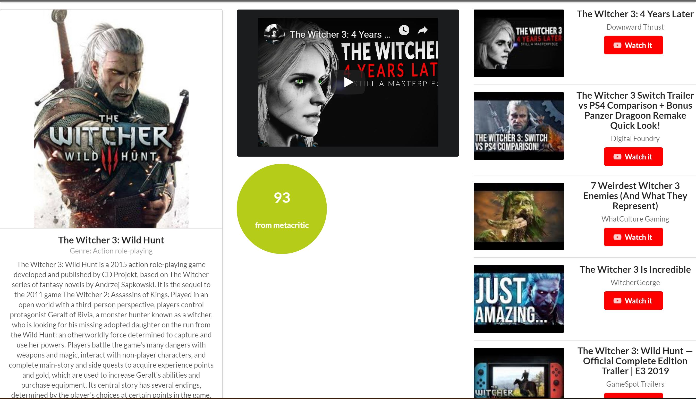
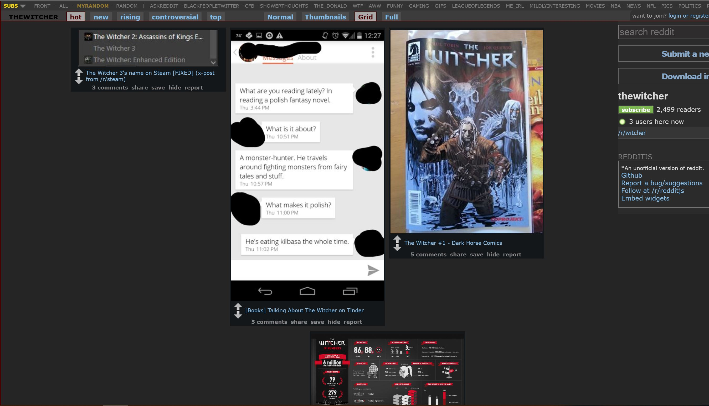

# critical-close-up: A Web Search App built using ReactJS

The app performs a curated search on video games and movies. Upon entry of a query, the app loads up a dashboard view of information related to the queried video game/movie from Wikipedia, YouTube, MetaCritic, and Reddit.

## Images
### _Initial State_

### _Search Result_

###  _Scroll down results page to view SubReddit of the queried product_

